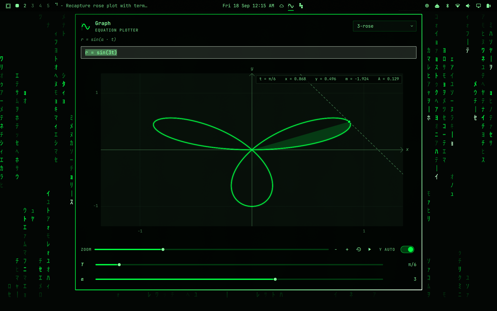

# Graph

A theme-aware graphing calculator for the [Omarchy](https://omarchy.org/) shell.
Type an equation, and the plot follows the colors, fonts, and corners of the
theme you already have selected.



Coefficients become sliders. `y = 2*sin(x)` grows an `a` slider whose default
is 2; `y = a*sin(b*x + c)` gives you `a`, `b`, and `c`. A tracer slider walks
the independent variable so you can read `(x, y)` live.

## Open it

- Click the sine-wave icon in the bar
- Ctrl+Alt+G (your Omarchy modifier + Ctrl + G)
- Omarchy menu → Trigger → Graph
- `omarchy-shell shell toggle graph`

## Type

`y =` is implied. These all work:

```
sin(x)
2*sin(x)
a*sin(b*x + c)
x^2
1/x
sin(x); cos(x)
sum(n=1 to 7, 1.5/sqrt(n)*sin(n*x))
sum from n=1 to 7 of 1.5/sqrt(n)*sin(nx)
z = x^2 + y^2
sin(x)*cos(y)
r = 1 + cos(t)
r = sin(3t)
x = cos(t); y = sin(3t)
x^2 + y^2 = 1
x^2 - y^2 = 1
```

The index (`n`) is bound by the sum, not a slider. The upper limit becomes an
integer **N** slider so you can add terms live; coefficients in the body still
become ordinary sliders (`1.5` → `a`).

`r = ...` is polar (θ or `t` is the angle). `x = ...; y = ...` (or a comma) is
parametric. An equation in both `x` and `y` with `=`, like `x^2 + y^2 = 1`,
is an implicit curve. The tracer walks the parameter; a dashed tangent and a shaded area
to the tracer update live (`m` and `A` in the readout). **TANGENT** and
**AREA** toggles turn those off. The tracer snaps to the points worth landing
on — where the curve crosses the axis, where it turns around, and where two
series meet — so an area runs to an exact boundary rather than to the nearest
sample. A caught tracer turns the alert color, grows a ring, and names what it
caught (**ZERO**, **PEAK**, **CROSS**) in the readout. **←** / **→** walk the
tracer from one feature to the next, so you can survey a function without
aiming at it.

**d/dx** overlays the derivative as another series. It is differentiated
symbolically — `sin(x)` gives `cos(x)`, `x^x` gives `x^x · (ln(x) + 1)` — so
the curve and the `m` readout are exact rather than a difference of neighbouring
samples; equations with no rule (`min`, `max`, `hypot`) fall back to central
differences. With **BETWEEN** on, the shading and `A` measure the gap between
the first two series instead of the drop to the axis, which with the crossings
snapped is the usual "area between two curves".

The area runs from the origin by default. Space (or the pin next to **FROM**,
or shift-click on the plot) pins the lower limit at the tracer instead, and
`x` clears it; the limit shows up as a dashed `a` rule and in the readout. With
both ends snapped to features, `A` is a real definite integral — one hump of
`sin(x)`, one petal of a rose, the area under a peak.

Each slider has a play button on the right: press it and that slider starts
sweeping from where it sits, press it again to stop. The play button in the zoom row does the same for zoom, so the plot
zooms in and back out on its own. Run as many at once as you like — touching a
slider only stops that one.

If both `x` and `y` appear (or the left-hand side is `z`), the plot becomes a
3D surface. Drag to orbit (elevation goes from −90° to 90°, so you can look
straight down), scroll the mouse wheel over the plot to zoom, **AZ** / **EL** sliders to rotate, or the
overhead button for a top view. Hover a vertex to read `(x, y, z)`.

Implicit multiplication (`2sin(x)`, `2pi`, `2x^2`, `nx`), `|x|`, `π`, `Σ`, and `;` to
overlay a second series are supported. Functions include `sin` `cos` `tan`
`asin` `acos` `atan` `exp` `ln` `log` `log10` `sqrt` `abs` `sinc` `sec` `csc`
`cot` and the usual hyperbolic cousins.

## Plot

- Drag to pan, scroll to zoom toward the cursor
- Double-click or the reset button restores the default window
- Right-click the plot also resets
- `+` / `-` zoom, `[` / `]` pan, `0` reset, `a` toggles Y auto-scale
- `←` / `→` step the tracer between features, space pins the area's lower
  limit there, `x` clears it
- `t` and `s` toggle the tangent and the shaded area, `d` the derivative,
  `b` the between-curves mode
- Tick labels switch to π, π/2, 2π when the window is a trig range

The first series is the theme accent. Further series pick cyan / magenta /
yellow from the current `colors.toml`.

## Install

```sh
omarchy plugin add https://github.com/1990wn/omarchy-graph.git --enable
```

That clones the repo into `~/.config/omarchy/plugins/graph/`. Click the
sine-wave icon in the bar, or run:

```sh
omarchy-shell shell toggle graph
```

Put the icon somewhere else with:

```sh
omarchy bar put graph --section center --after omarchy.weather
```

## Remove

```sh
omarchy plugin disable graph
omarchy plugin remove graph --yes
```

Disable leaves the files in place so you can turn it back on. Remove deletes
the checkout. Neither command edits other plugins or your theme.

## License

MIT. See [LICENSE](LICENSE).
